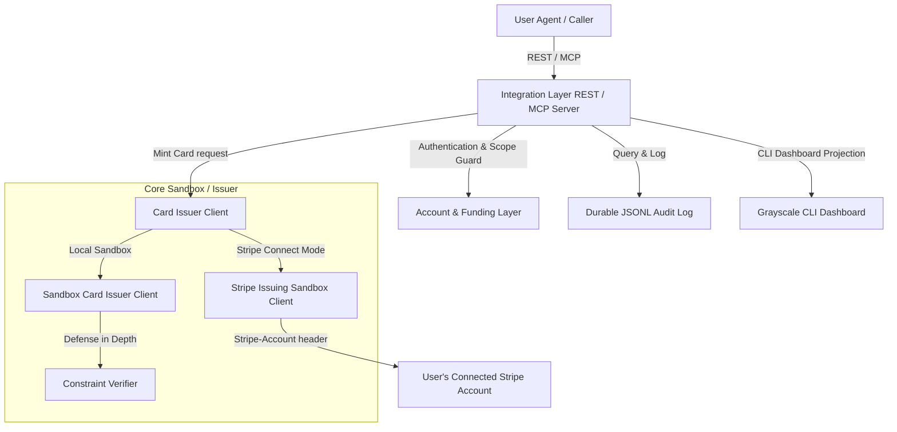

# ZeroDOM

ZeroDOM is open-source infrastructure for agent-safe autonomous payments. It provisions isolated virtual payment accounts, reserves funded balances, and mints single-task, tightly scoped virtual payment cards. This ensures that amount, merchant category, expiry, and single-use constraints are enforced at the issuer level, completely outside the agent's reasoning.

ZeroDOM is agent-agnostic and multi-tenant: any agent framework (such as Claude, Codex, Hermes, OpenClaw, or custom scripts) can request scoped cards via a REST API or Model Context Protocol (MCP) server. Every transaction and balance constraint is scoped to the user account's API key, ensuring strict tenant isolation.

---

## 📋 Copy-Paste Prompt for Your AI Assistant

If you want an AI agent to build, test, start, and integrate ZeroDOM in this repository, copy the text inside the block below and paste it directly into your AI coding assistant (Claude, Cursor, Windsurf, etc.):

```text
You are an AI coding assistant. We are adopting ZeroDOM for autonomous payment uses in this codebase. Follow these steps sequentially:
1. Compile the TypeScript codebase:
   npm run build
2. Run typechecks and the test suite to verify system integrity:
   npm run typecheck && npm test
3. Run the live Playwright checkout and verifier demo:
   npm run live-demo
4. Boot the Express card-issuer and checkout server:
   npm run server
5. Inspect `examples/live-demo.ts` and `src/agent.js` to see how virtual cards are minted and charged, then integrate this scoped payment pattern into our custom payment flows.
Report back once all steps compile and run successfully!
```

---

## System Architecture



---

## Key Features

1. **Account & Funding Layer**: Hashed API keys (`zd_test_...` with `scrypt`), separate per-account balance reservations, and strict multi-tenant boundary checks (one tenant can never touch or query another tenant's cards, balance, or logs).
2. **Scope Definer**: Standardized `TaskScope` inputs enforcing an amount cap, merchant lock (merchant category MCC or merchant name), future expiry TTL, and single-use flag.
3. **Dual Card Issuer Clients**:
   - **Sandbox Mode**: Generates valid test card numbers (Luhn checked) for browser automation checkout tests.
   - **Stripe Issuing + Connect Sandbox**: Direct API integration with Stripe Connected accounts using the `Stripe-Account: acct_...` header. Maps scopes to Stripe's native issuing spending controls, category locks, and single-use lifecycle controls.
4. **Constraint Verifier**: Application-level validation running defense-in-depth checks on amount, category, expiry, and reuse before or in parallel with bank/issuer checks.
5. **Durable JSONL Audit Log**: Append-only audit trail enabling full task story reconstruction after process restart, redacting full PAN/CVC credentials at all times.
6. **Integration Layer (REST + MCP)**: Dual stdio-based MCP server and HTTP REST server. Supports `mint_card`, `get_card_status`, `authorize_transaction`, and `list_audit_log` tools.
7. **Grayscale Dashboard/CLI**: Black, white, and gray visual monitors designed specifically for terminal dashboard renders and debugging traces.

---

## Setup & Environment

1. Install dependencies:
   ```bash
   npm install
   ```

2. Copy the environment template:
   ```bash
   cp .env.example .env
   ```

3. Configure variables inside `.env`:
   - `STRIPE_SECRET_KEY`: Stripe sandbox key (`sk_test_...` prefix required).
   - `STRIPE_CONNECT_ACCOUNT_ID`: Connected account ID (`acct_...` prefix).
   - `STRIPE_ISSUING_CARDHOLDER_ID`: Connected account's cardholder (`ich_...` prefix).
   - `ZERODOM_MCP_API_KEY`: API key for local MCP stdio server authentication.
   - `ZERODOM_MCP_CONNECT_ACCOUNT_ID`: Connected account for local MCP testing.

---

## Running Commands

ZeroDOM bundles all capabilities into a local CLI executable named `zerodome` (defined in `bin/zerodome.js`):

### 1. Verification & Readiness Checks
- **Readiness Check**: Performs inline validation of the 6 exit criteria in the Build Specification (deterministic decline checks, isolation, redaction, task story reconstruction):
  ```bash
  npm run readiness-check
  # or
  node bin/zerodome.js readiness-check
  ```
- **Test Suite**: Run the complete Vitest test suite (55 tests):
  ```bash
  npm test
  ```
- **TypeScript Compilation**:
  ```bash
  npm run typecheck
  ```

### 2. Demos & Servers
- **Local Card Demo**: Mints approved and over-cap cards in memory, verifies declines, and projects the grayscale dashboard:
  ```bash
  npm run card-demo
  # or
  node bin/zerodome.js card-demo
  ```
- **Durable Audit Log Demo**:
  ```bash
  npm run audit-demo
  ```
- **Integration REST Server**: Runs the HTTP REST server on port `4080`:
  ```bash
  npm run integration-server
  ```
- **Integration MCP Server**: Runs the MCP stdio server:
  ```bash
  npm run mcp-server
  ```
- **Integration Layer Demo**: Runs a REST/MCP client simulation end-to-end:
  ```bash
  npm run integration-demo
  ```

### 3. Stripe Sandbox Smoke Test
Verifies Stripe Connect API headers, virtual card creation, test-helper authorization simulation, and card deactivation cleanup:
```bash
npm run stripe-sandbox-smoke
# or
node bin/zerodome.js stripe-smoke
```
*(Requires Stripe Connect test-mode account with Stripe Issuing enabled).*

---

## Model Context Protocol (MCP) Integration

ZeroDOM features a fully compliant, production-ready **Model Context Protocol (MCP)** server communicating over `stdio`. This allows agent clients (such as Claude, Cursor, Windsurf, or custom LLM executors) to request and control virtual cards autonomously.

### Exposed Tools
- **`mint_card`**: Request a new virtual payment card.
  - *Parameters*: `caller_id` (string), `task_scope` (object containing `maxAmount`, `merchantLock`, `ttlSeconds`, `singleUse`).
- **`get_card_status`**: Query the balance, spending lock, and status of an issued card.
  - *Parameters*: `card_id` (string).
- **`authorize_transaction`**: Simulate or request a payment authorization against card constraints.
  - *Parameters*: `card_id` (string), `attempted_amount` (number), `attempted_merchant` (string), `attempted_merchant_category` (optional string).
- **`list_audit_log`**: Retrieve the append-only log of scope definitions, mints, attempts, and revocations.
  - *Parameters*: None.

### Production Execution Setup
Ensure you compile the TypeScript files to native JavaScript first:
```bash
npm run build
```

### Claude Desktop Configuration
To connect Claude Desktop to the ZeroDOM MCP server, add the server to your `claude_desktop_config.json` (located at `~/Library/Application Support/Claude/claude_desktop_config.json` on macOS or `%APPDATA%\Claude\claude_desktop_config.json` on Windows):

```json
{
  "mcpServers": {
    "zerodom": {
      "command": "node",
      "args": [
        "/Users/ramprasadgoud/Documents/ZeroDOM/dist/scripts/mcp-server.js"
      ],
      "env": {
        "ZERODOM_MCP_API_KEY": "zd_test_your_secret_api_key_here",
        "ZERODOM_MCP_CONNECT_ACCOUNT_ID": "acct_your_stripe_connect_id_here",
        "ZERODOM_MCP_INITIAL_BALANCE": "10000"
      }
    }
  }
}
```

### IDE Configuration (Cursor & Windsurf)
Add the server under **Cursor Settings > Features > MCP**:
- **Name**: `ZeroDOM`
- **Type**: `command`
- **Command**: `node /Users/ramprasadgoud/Documents/ZeroDOM/dist/scripts/mcp-server.js`

Add the environment variables (`ZERODOM_MCP_API_KEY`, `ZERODOM_MCP_CONNECT_ACCOUNT_ID`, etc.) to match your account properties.

---

## Production Readiness Checklist

When moving ZeroDOM core from local sandbox/testing to production deployment, implement the following changes:

- [ ] **Stripe Connect OAuth Onboarding**: Replace sandbox account provisioning with Stripe Connect onboarding redirect webhooks to automatically authenticate and register user accounts.
- [ ] **Durable Database Persistence**: Replace in-memory ledger maps (`SandboxAccountStore` and `SandboxCardIssuerClient`) with transaction-isolated relational stores (e.g. PostgreSQL + Redis for reservations).
- [ ] **Stripe Merchant-Name Locks**: Since Stripe Issuing's public REST API only supports category controls (`allowed_categories`), exact merchant-name locks are currently checked by the application-level `ConstraintVerifier`. For production merchant locks, request access to Stripe's private preview for merchant-ID spending controls.
- [ ] **Background Expiry Sweep Service**: Run the `expireDueCards()` sweep task in a reliable production cron queue (rather than a simple in-memory setInterval loop) to release reservations and close expired cards.
